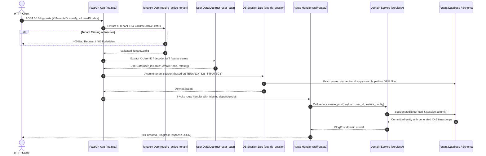

# Request & Tenancy Lifecycle

How does an HTTP request travel from the wire through FastKitty's dependency layers and into the database?

FastKitty relies on **FastAPI dependency injection (`Depends`)** to resolve context deterministically without global thread-local variables.

---

## The Request Lifecycle Diagram



---

## Lifecycle Stages Explained

### 1. HTTP Request Arrival
The client sends an HTTP request containing tenant and user identification headers:
```http
POST /v1/blog-posts HTTP/1.1
Host: api.example.com
X-Tenant-ID: spotify
X-User-ID: alice
Content-Type: application/json
```

### 2. Tenant Context Resolution (`api/deps/tenancy.py`)
- `get_tenant_config`: Reads `X-Tenant-ID`. If missing, raises `400 Bad Request`. Queries the active config provider (file, Consul, Redis). If not found, raises `404 Not Found`.
- `require_active_tenant`: Verifies `tenant_config.is_active is True`. If `False`, raises `403 Forbidden`.

### 3. User Identity Extraction (`api/deps/user_data.py`)
Depending on `USER_DATA_SOURCE`:
- **`header`**: Extracts `X-User-ID`, `X-User-Email`, `X-User-Roles`.
- **`jwt`**: Decodes unverified claims payload from `Authorization: Bearer <token>`.
- **`claims`**: Parses JSON payload from `X-User-Claims`.

### 4. Database Session Resolution (`api/deps/db.py`)
- Reads the active `TENANCY_DB_STRATEGY`.
- Fail-closes on tenant status: `get_db` directly depends on `require_active_tenant`, ensuring inactive tenants are rejected with `403 Forbidden` before a DB connection or session is ever allocated.
- Fetches the tenant's database connection credentials from the active secrets provider.
- Acquires or pools the async engine via the LRU cache.
- For `schema` strategy, attaches an `after_begin` event listener executing transaction-scoped `SET LOCAL search_path TO "<schema>"`. Note that `public` is deliberately excluded so that an unmigrated tenant cannot accidentally read shared fallback tables in the public schema.
- Yields the `AsyncSession` to the request scope.

### 5. Thin Route Delegation (`api/routes/v1/`)
The route handler extracts request data, receives the injected service and feature configuration, and delegates all business logic to the service layer.

### 6. Cleanup & Teardown
- FastAPI automatically triggers generator cleanup in `get_db_session`.
- Any uncommitted transactions are rolled back.
- In `schema` strategy, `SET LOCAL` search path settings naturally revert at transaction end.
- The connection is cleanly returned to the pool.
