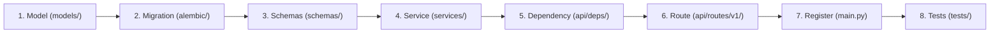

# End-to-End Guide: Adding a New Route & Table

This step-by-step tutorial demonstrates how to add a completely new multi-tenant feature from scratch in FastKitty, using the example of a **Projects** feature.

---

## The Workflow Overview



---

## Step 1: Define the Database Model

Create `models/projects.py`:

```python
from sqlalchemy import Integer, String, Text
from sqlalchemy.orm import Mapped, mapped_column

from models.base import Base, TenantScopedModel, TimestampedModel


class Project(TenantScopedModel, TimestampedModel, Base):
    __tablename__ = "projects"

    id: Mapped[int] = mapped_column(Integer, primary_key=True, autoincrement=True)
    name: Mapped[str] = mapped_column(String(255), nullable=False)
    description: Mapped[str | None] = mapped_column(Text, nullable=True)
```

> [!NOTE]
> Inheriting from `TenantScopedModel` automatically adds `tenant_id: Mapped[str]` with an index. Inheriting from `TimestampedModel` automatically adds UTC `created_at` and `updated_at`.

Register your new model in `models/__init__.py`:
```python
from models.projects import Project

__all__ = ["Base", "BlogPost", "Project"]
```

---

## Step 2: Generate & Apply the Migration

Generate a new migration script using Alembic:

```bash
uv run alembic revision --autogenerate -m "create projects table"
```

Apply the migration across all tenant databases and schemas:

```bash
uv run alembic upgrade head
```

---

## Step 3: Define Request & Response Schemas

Create `schemas/projects.py` with Pydantic models:

```python
from datetime import datetime
from pydantic import BaseModel, ConfigDict


class ProjectCreate(BaseModel):
    name: str
    description: str | None = None


class ProjectResponse(BaseModel):
    model_config = ConfigDict(from_attributes=True)

    id: int
    tenant_id: str
    name: str
    description: str | None
    created_at: datetime
    updated_at: datetime
```

---

## Step 4: Write the Business Service

Create `services/projects_service.py`. Remember: services take only `session: AsyncSession` and remain unaware of HTTP or database isolation strategies:

```python
from collections.abc import Sequence
from sqlalchemy import select
from sqlalchemy.ext.asyncio import AsyncSession

from models.projects import Project
from schemas.projects import ProjectCreate


class ProjectsService:
    def __init__(self, session: AsyncSession) -> None:
        self.session = session

    async def create_project(self, payload: ProjectCreate) -> Project:
        project = Project(
            name=payload.name,
            description=payload.description,
        )
        self.session.add(project)
        await self.session.commit()
        await self.session.refresh(project)
        return project

    async def list_projects(self) -> Sequence[Project]:
        result = await self.session.scalars(
            select(Project).order_by(Project.created_at.desc())
        )
        return result.all()
```

---

## Step 5: Wire Dependency in `api/deps/db.py`

In `api/deps/db.py`, create a dependency factory that injects the current tenant's database session into `ProjectsService`:

```python
from services.projects_service import ProjectsService


async def get_projects_service(
    session: AsyncSession = Depends(get_db_session),
) -> ProjectsService:
    return ProjectsService(session)
```

---

## Step 6: Create the Route Handler

Create `api/routes/v1/projects.py`:

```python
from typing import Annotated
from fastapi import APIRouter, Body, Depends, status

from api.deps.db import get_projects_service
from api.deps.tenancy import require_active_tenant
from schemas.projects import ProjectCreate, ProjectResponse
from services.projects_service import ProjectsService

router = APIRouter(
    tags=["Projects"],
    dependencies=[Depends(require_active_tenant)],  # Enforce active tenant
)


@router.post(
    "/projects",
    status_code=status.HTTP_201_CREATED,
    response_model=ProjectResponse,
)
async def create_project(
    payload: Annotated[ProjectCreate, Body()],
    service: ProjectsService = Depends(get_projects_service),
) -> ProjectResponse:
    project = await service.create_project(payload)
    return ProjectResponse.model_validate(project)


@router.get(
    "/projects",
    response_model=list[ProjectResponse],
)
async def list_projects(
    service: ProjectsService = Depends(get_projects_service),
) -> list[ProjectResponse]:
    projects = await service.list_projects()
    return [ProjectResponse.model_validate(p) for p in projects]
```

---

## Step 7: Mount the Router in `main.py`

In `main.py`:

```python
from api.routes.v1.projects import router as projects_router

app.include_router(projects_router, prefix="/v1")
```

---

## Step 8: Test Your New Endpoint

Send a curl request with the tenant header:

```bash
curl -X POST http://127.0.0.1:8000/v1/projects \
  -H "X-Tenant-ID: spotify" \
  -H "Content-Type: application/json" \
  -d '{"name": "Podcast Recommendation Engine", "description": "AI model deployment"}'
```

**Response**:
```json
{
  "id": 1,
  "tenant_id": "spotify",
  "name": "Podcast Recommendation Engine",
  "description": "AI model deployment",
  "created_at": "2026-10-03T17:30:00Z",
  "updated_at": "2026-10-03T17:30:00Z"
}
```

Now list projects for Airbnb:
```bash
curl -X GET http://127.0.0.1:8000/v1/projects \
  -H "X-Tenant-ID: airbnb"
```
**Response**: `[]` (empty list — complete data isolation guaranteed!).
